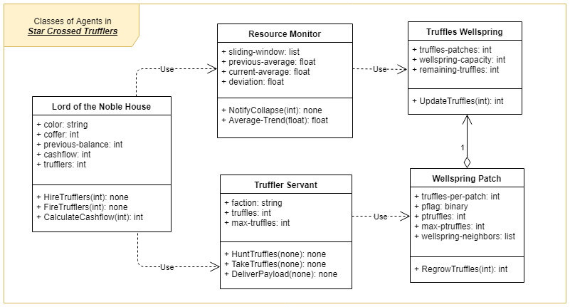
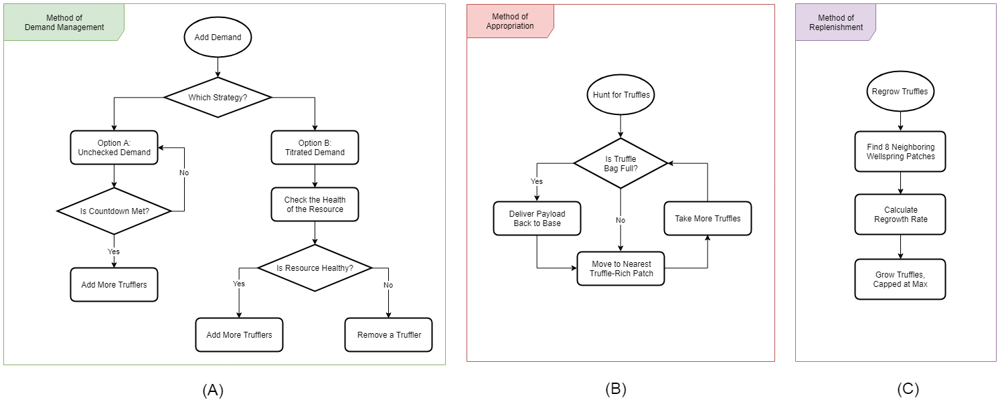
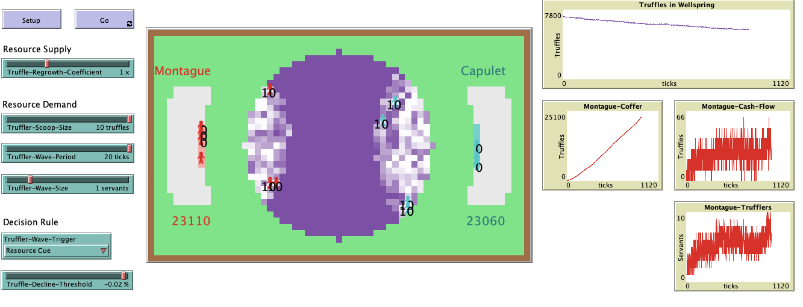

# Star-Crossed Trufflers: A Tragedy (of the Commons)

## Abstract

"A resource is defined as a source or supply from which an entity can derive benefits. One specific class of resource, known as a common-pool resource (CPR), has special properties that distinguish it from more general resource categories. CPR are an important class of resources to study, because they have wide ranging impacts with regards to both spatial scale and temporal scale. Furthermore, CPR systems tend to be difficult to manage, due to the access structure and the incentives involved in utilizing the resource. When CPR systems are mismanaged and over-exploited, a wide
variety of negative impacts can result, including resource depletion destruction, excessive pollution of the environment, and species extinction. However, when CPR systems are managed properly and used sustainably, long-term benefits can be realized from this type of resource."

## &nbsp;

The UML class diagram of the agents in the model: 

The NetLogo Graphical User Interface of the Model: 

The NetLogo Graphical User Interface of the Model: 

## &nbsp;

**Version of NetLogo**: NetLogo 6.1.0

**Semester Created**: Spring 2019.