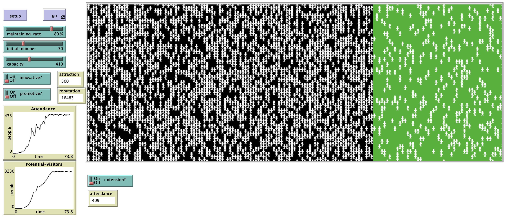

# An Agent-­Based Model on Tourism Destination Lifecycle Theory

## Abstract

"Tourism destination lifecycle theory asserts that a destination will go through six different stages of vitality and popularity overtime, and the description of this life track should follow an s-shape curve. This theory was proposed in the supplyside setting, focusing on how the quantities of investigators and investment change through time. Although much research has validated the theory in statistical settings utilizing real data, few works have been carried out to show how this trend forms in a microscopic way from individual travellers’ choices. This research tries to explain the formation of the trend of destination lifecycle utilzing an Agent-Based Model. The model attempts to show how changing patterns of system emerge from different individuals’ behaviors. The key finding of this research is that the framework adequately represents the changing pattern of destination lifecycle even when using individual arrivals. The model also shows how innovations can help with attracting more travellers. While promotion may do harm to the reputation when a destination is attractive enough to reach the traveller capacity. Capacity is the life-­changing factor, which can give a second life to destinations when they are in stagnant stage."

## &nbsp;
The NetLogo Graphical User Interface of the Model: 

## &nbsp;

**Version of NetLogo**: NetLogo 6.1.0

**Semester Created**: Spring 2015.
