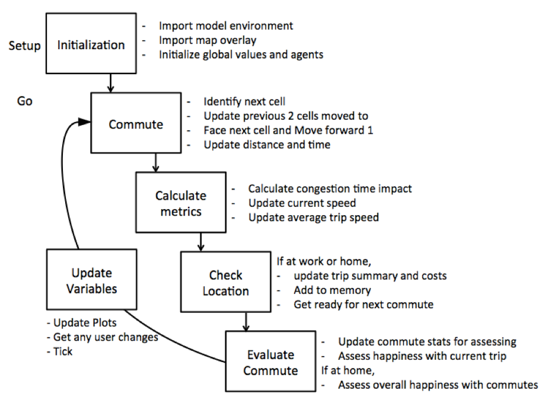
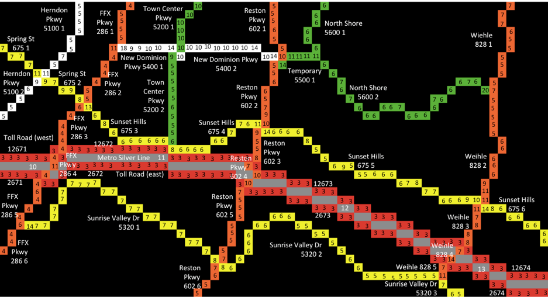
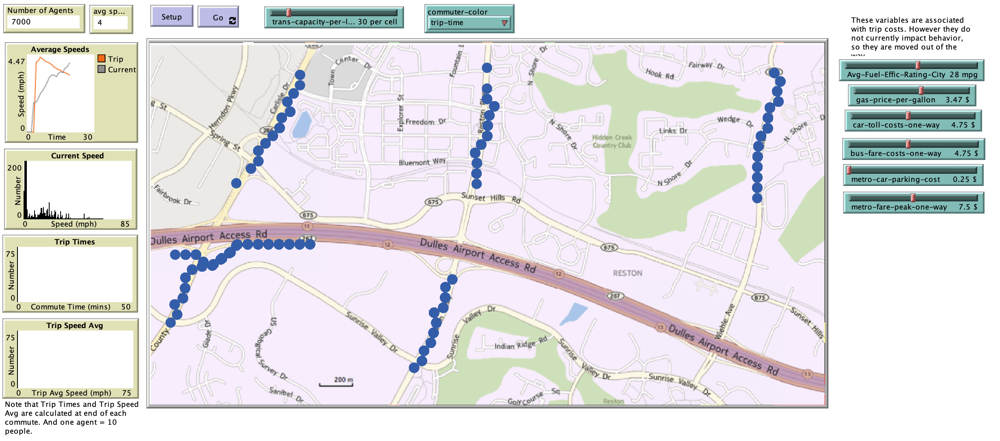

# Simulating suburban commuter behavior in Reston, Virginia: An agent-based transportation model

## Abstract

"The simulation of commuter behavior in a suburban environment can be helpful for understanding how landuse development and transportation planning impact commute trip duration, speed, costs, and commuter contentedness with their commute history. Agent-based modeling was used to develop a raster-based, meso-scale suburban transportation model to simulate commuters traveling between home and work. The model was applied to the suburban Washington DC area of Reston, Virginia USA. The results show that a raster-based transportation model that takes into account residential density, transportation volume and capacity, and commuting costs can simulate commuter behavior. This model can be built upon to analyze more complex scenarios for development, planning, and commuter decision-making."

## &nbsp;
Model concept flow - This figure shows the sequence of the six modules and key processes of each:

The representation of the transportation network for Reston, VA:

The NetLogo Graphical User Interface of the Model: 

##Setup Instructions
To run the transit model:

* set the speed to just about the full maximum of fast, otherwise it is really slow.
* hit the setup button first to load the display (takes a few seconds).
* run and stop the model using the Go button.
* note you can change the display color of the commuter agents (red generally means bad)
* there is only one user-setting variable that can be adjusted that impacts the model.

## &nbsp;

**Version of NetLogo**: NetLogo 6.1.0

**Semester Created**: Spring 2014
