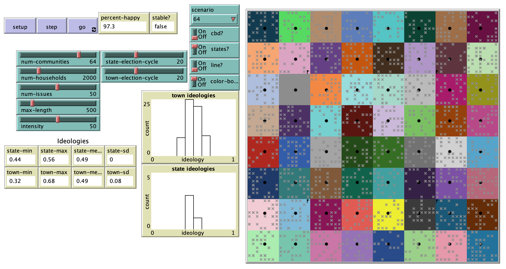

# Two-tiered Tiebout: An agent-based model of federalism

## Abstract

"This agent-based model explores federalist politics inspired by the work of Charles Tiebout. Agents vote in local and state elections, moving to another location if they are dissatisfied with the policies offered. The introduction of state-level polities impedes traditional Tiebout sorting but does not defeat it. A demonstration of how a von Thünen model can be incorporated into a Tiebout model is also introduced; its effect on household behavior proves to be relatively small. These findings have implications for economic geographers and political theorists concerned with the structure of democratic systems."

## Reference
Tiebout, C. M. (1956). A pure theory of local expenditures. Journal of political economy, 64(5), 416-424.

## &nbsp;
The NetLogo Graphical User Interface of the Model: 

## &nbsp;

**Version of NetLogo**: NetLogo 6.1.0

**Semester Created**: Spring 2015.
