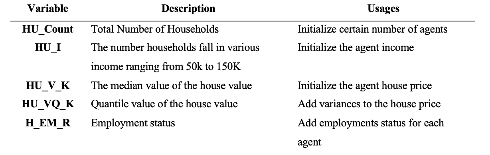
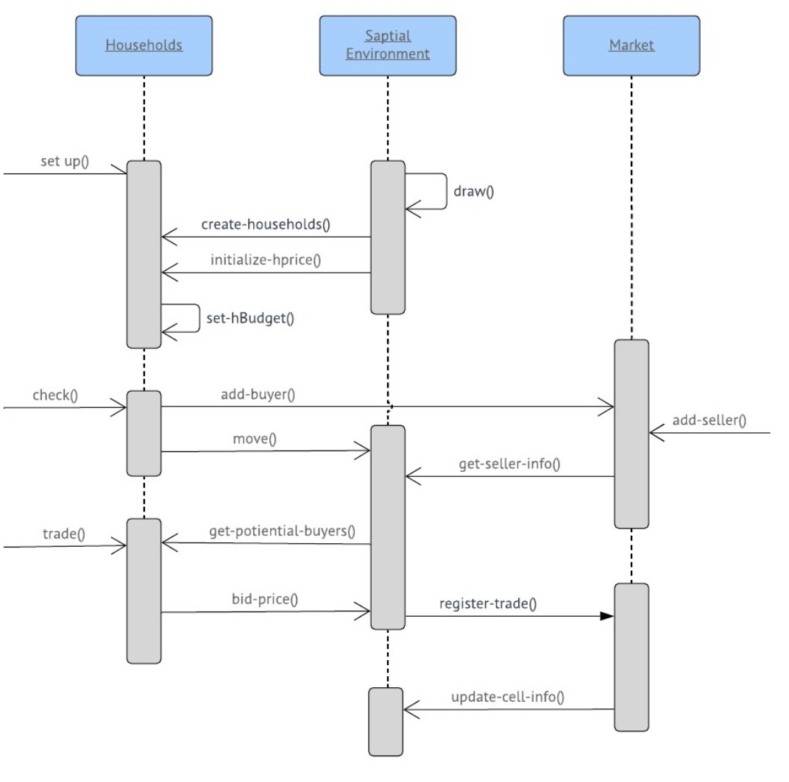
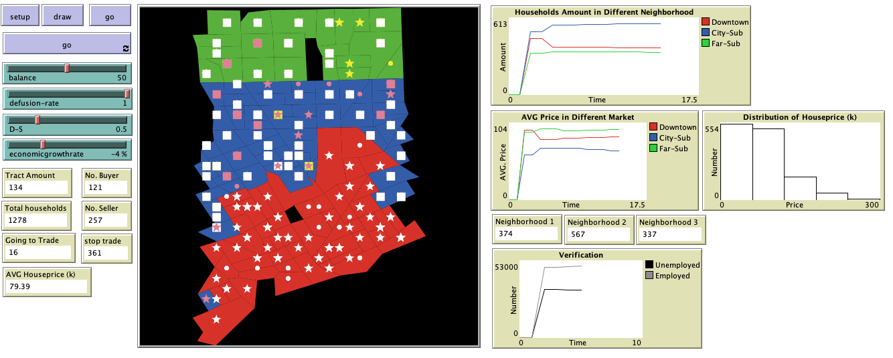

# Exploring Urban Shrinkage by Simulation of Housing Market in Detroit: An Agent-Based Model Implementation

## Abstract
"Urban shrinkage has become a global phenomenon. A lot of problems are brought by the shrinkage including population loss, economic depression, vacant properties issues and the contraction of the land or housing market. This model demonstrates an agent-based model (ABM) parametrized by spatial explicit data simulates the urban shrinkage in the Detroit Tri-county area in order to explore how micro-level housing trades impact on macro-level urban shrinkage by capturing trading behavior between sellers and buyer within different dynamic sub-housing markets in this area. In addition, verification and validation are operated through multiple methods. To conclude, this work demonstrates the threshold and potentials to explore urban shrinkage through the computational simulation approach."

## &nbsp;

Agent Variables:

Buyer Decision Making Process:

UML Diagram of the Model:

The NetLogo Graphical User Interface of the Model: 

## &nbsp;

**Version of NetLogo**: NetLogo 6.1.0

**Semester Created**: Spring 2019.