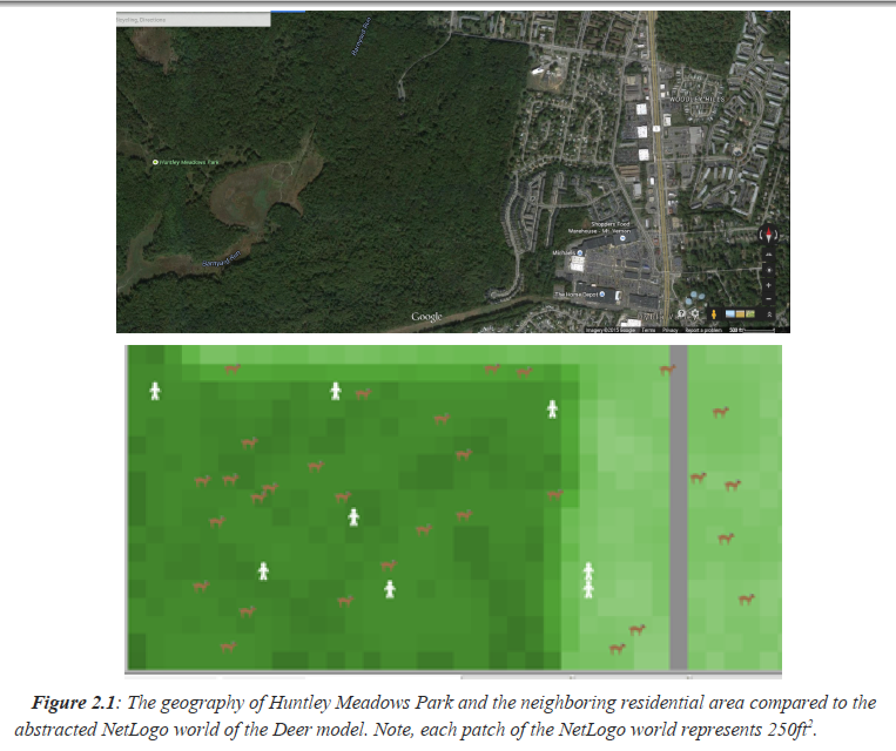
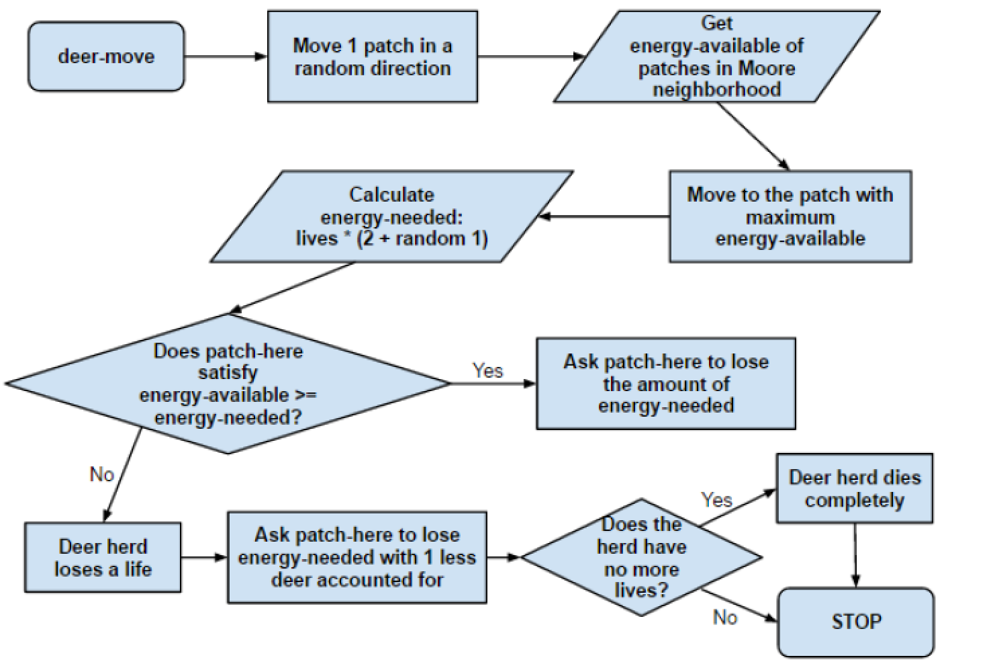
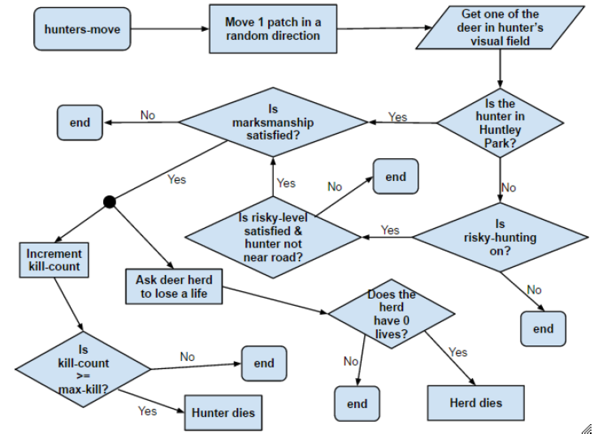
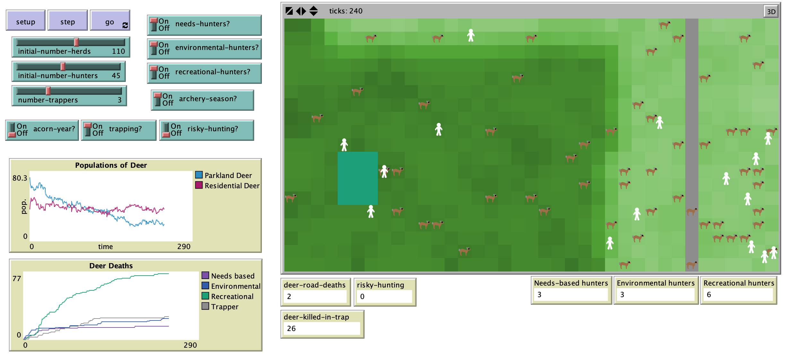

# Investigating WhiteTail Deer in Huntley Meadows Park: An AgentBased Geospatial Model of Deer Overpopulation and the Archery Program Solution in Fairfax County, Virginia

## Abstract

"This model seeks to better understand and analyze the effect of the Archery Program in Fairfax County, Virginia, on the change in population of White Tail Deer over the course of one hunting season. Deer are a hazard to the human population in this area due to destruction of property (particularly gardens and fences), the spread of Lyme disease, risk of deerrelatedcar accidents, and competition with other nativespecies. For these reasons, the over population of deer in Fairfax County must be addressed. To understand and analyze methods for controlling the deer population, an agent based geospatial model was created with deer and hunter agents using NetLogoas an abstraction of Huntley Meadows Park and the neighboring residential area in Fairfax County, Virginia. This model found that allowing hunters to kill deer in the residential area, set up garden traps in the park, and kill large numbers of deer all had significant impact on the deer population. Depending on whether or not it happens to bean acorn year in this area, we recommend different combinations of hunting practices toachieve the desired percentage decrease in the deer population."

## &nbsp;

Real world abstracted into NetLogo environment:

Schematic of the movement and behavior of deer agents for one tick of the model:

Schematic of the behavior and movement of hunters in the Deer model. Note, trappers do not move but do follow the same behavioral processes of the other hunters. This schematic also depicts the effect of successful shots on the deer herds since this is part of the movehunters procedure:

The NetLogo Graphical User Interface of the Model: 

## &nbsp;

**Version of NetLogo**: NetLogo 6.1.0.

**Semester Created**: Spring 2015.

