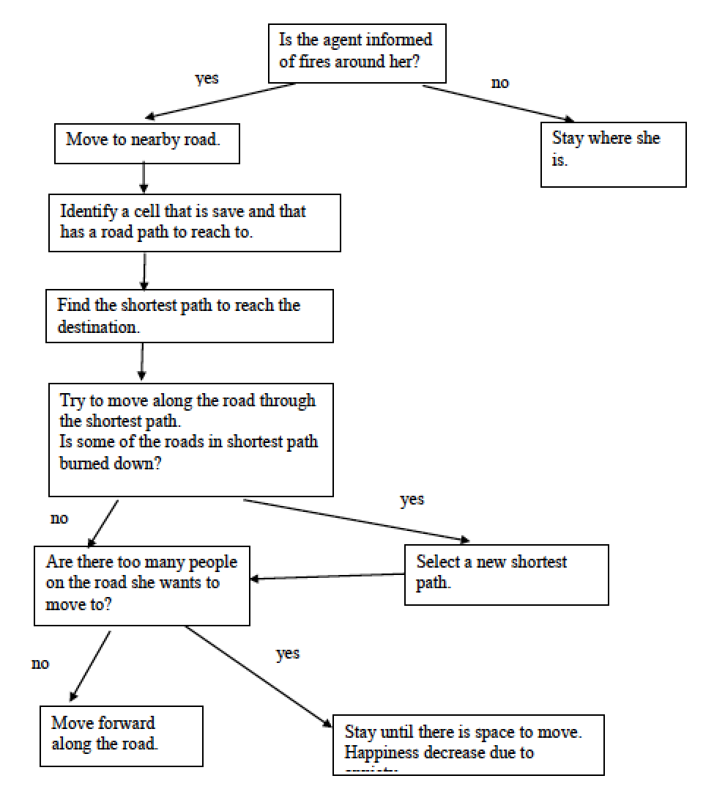
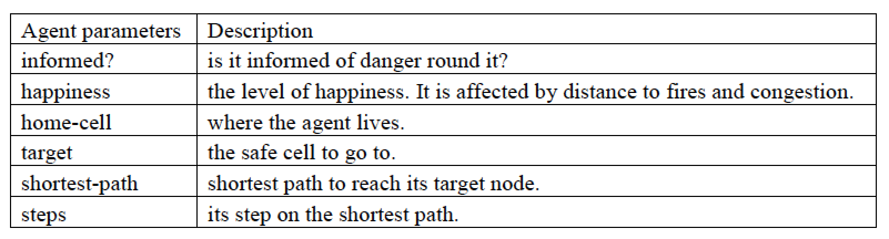
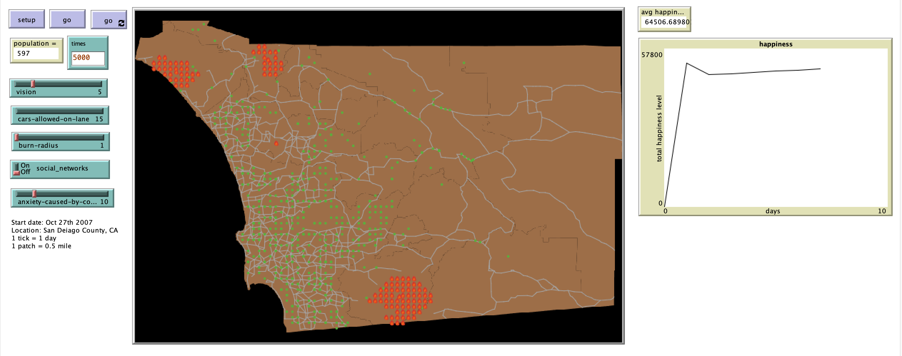

# Spatial Agent-Based Model for The Effect of Social Network on Wildfire Evacuation

## Abstract

"As human beings are trying to control the nature, the nature is unmanageable. Natural disasters are usually hard to predict in time, and can cause death and great loss of properties. Evacuation during natural disasters such as wildfires and floods is of great importance to control the loss. The recent development of social media, such as Facebook and Twitter, presents a new method to improve evacuation efficiency. Social media can provide people in the dangerous area with current and accurate information about the situation of the disaster and other conditions like road conditions that are hard to be obtained otherwise. In this paper, I take the Wildfires in San Diego County in 2007 as a case study, develop an Agent-based Modeling using GIS (geographical information system) data to study the decisions and behaviors of people in react of their knowledge of the changing environment."

## &nbsp;

Decision making state of agents

Agent parameters:

The NetLogo Graphical User Interface of the Model: 

## &nbsp;

**Version of NetLogo**: NetLogo 6.1.0.

**Semester Created**: Spring 2016.

