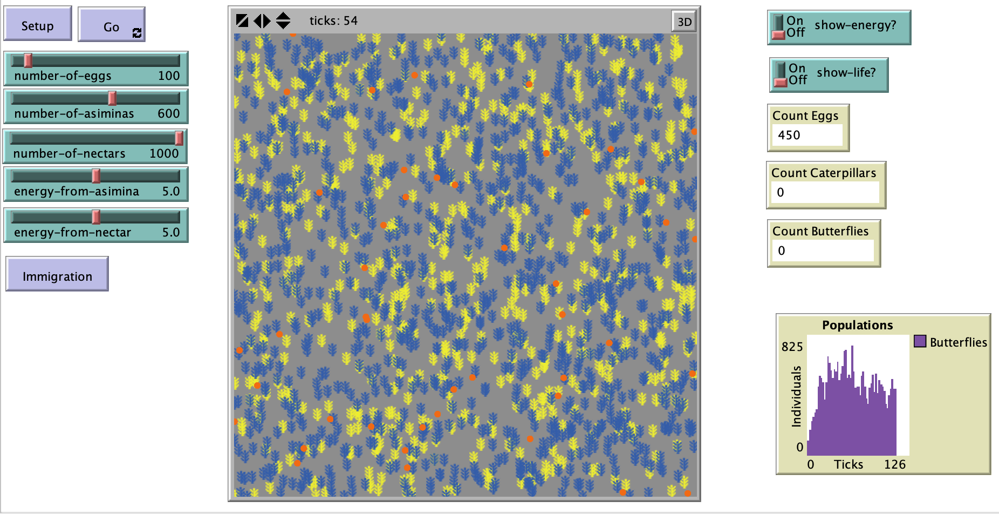

# The Conservation of the Zebra Swallowtail (Lepidoptera: Papilionidae)  Eurytides marcellus in Northern Virginia Forests: An Individual-Based Modeling Approach

## Abstract

"The purpose of this model is to visualize the interactions between Eurytides marcellus, their adult nectar sources, and larval food source Asimina triloba. An additional aim of this model is to simulate the potential population dynamics of E.marcellus depending on several modeled factors. These include the growth habits of Asimina triloba regarding seasonality, the affinity of E.marcellus larvae to consume young leaves, and the availability of adult nectar sources proximal to A. triloba. This model seeks to explain the crucial balance between adult and larval survival as a function of plant growth and seasonality. Specifically, to what degree does the concentration of nectar and food sources impact the ability of E.marcellus adults to successfully oviposit and reproduce? Within the model there are five types of agents, E.marcellus eggs, E.marcellus larvae, E.marcellus adults, A.triloba populations and nectar sources. The model space represents a heterogeneous stylized environment focused on patches with associated A. triloba populations and nectar sources distributed randomly. The plants are stationary within the model and their population dynamics are not explicitly modeled. The mobile agents are the E. marcellus adults, and to a lesser degree the E. marcellus larvae. The eggs of E. marcellus are stationary and distributed randomly by the adults of the previous generation. However, before an explanation of the behavior of the mobile agents it would be prudent to outline the environment in which they live."

## &nbsp;
The NetLogo Graphical User Interface of the Model: 

## &nbsp;

**Version of NetLogo**: NetLogo 6.1.0

**Semester Created**: Spring 2010

