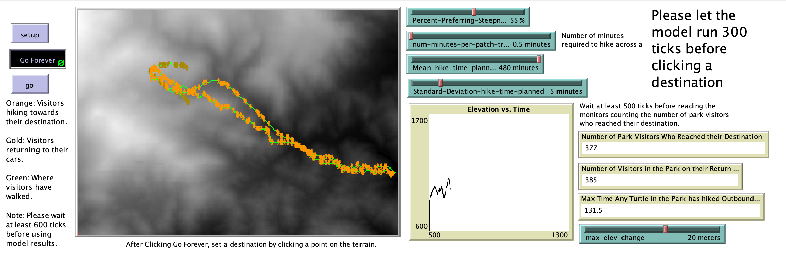

# Hiking & Elevation: Designing Park Trails for the Slope Preferences and Time Constraints of Visitors

## Abstract

"The terrain and length of a hiking trail to a destination influences the satisfaction of hikers. And not all hikers want the same thing – park managers must provide a variety of trails to meet the needs of a diverse set of users – including athletes, the elderly, bicyclists, dog walkers, and children. A model was created to aid park managers in designing new trails based on park terrain and distance. By entering how long visitors expect to hike, the maximum steepness of terrain they’re capable of hiking, their preference for either steepness or flatness, their walking speed, and a given destination, the model outputs a proposed trail, which is shown on the map."

## &nbsp;
The NetLogo Graphical User Interface of the Model: 

## &nbsp;

**Version of NetLogo**: NetLogo 6.1.0

**Semester Created**: Fall 2017.

