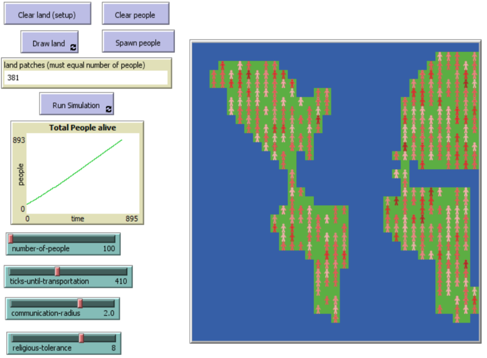

# Landscape and Religion

## Abstract

"The model exists for the user to observe the varying phenomenon which occurs during the spread of religious beliefs.  The user is able to create a landscape of their choosing and examine the rate at which religious ideas spread and the patterns of religious groups that develop in their chosen landscape.  The objective should be to create a landscape which resembles some where known or familiar, and to observe if the religious groups that develop resemble what the current areas known distribution is.  Afterwards the user may enter the second phase of the model to observe how the religions interact on a global scale.  The model has certain features that can be modified to influence the rate of religious interaction and resulting patterns.  One can choose to make the society of people behave in more or less tolerant ways to see how different behaviors affect the rate of change on various landscapes."
 

## &nbsp;
The NetLogo Graphical User Interface of the model: 

## &nbsp;

**Version of NetLogo**: NetLogo 6.1.0

**Semester Created**: Fall 2017.

