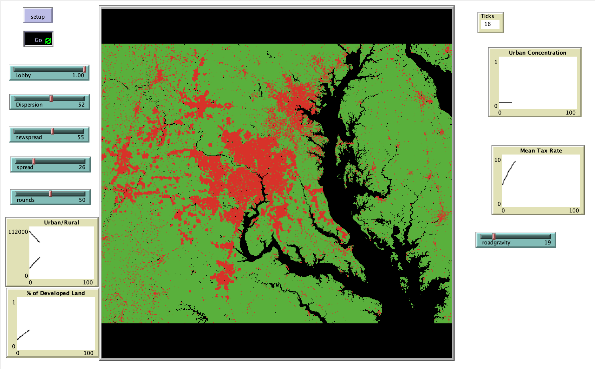

# Studying the Politics of Land-Use with the SLEUTH Model

## Description

The goal of this term paper is to examine the effect that changing land use regulations has on the growth and distribution of population within a metropolitan area over time. 

## &nbsp;

The NetLogo Graphical User Interface of the Model: 

## &nbsp;

**Versions of NetLogo**: NetLogo 6.1.0.

**Semester Created**: Spring 2010.
