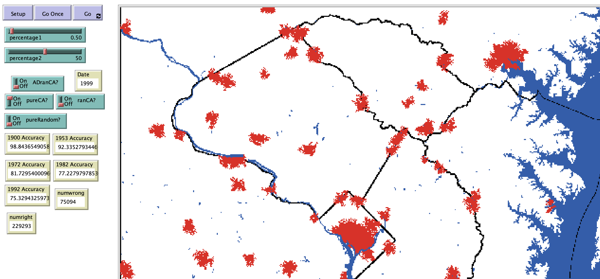

# Cellular Automata Model of Urban Growth in Washington DC and Baltimore, 1850-1992

## Abstract

"This paper seeks to build a simple cellular automata model to predict urban growth of urban areas in Washington DC and Baltimore from the year 1850 to 1992.  The cells are programmed to change state depending on one of four state-changing rule sets.  The competing rule sets are then compared to evaluate the accuracy with which they are able to predict growth across the one-hundred and forty-two year period.  The rule sets evaluated are referenced as the uniform weighted, simple weighted, extended weighted, and ratio weighted.  This model is inspired by the pioneering work of Michael Batty and Keith Clark but sought to follow even simpler rule sets for cell state change; for instance, unlike the more advanced SLEUTH model, this cellular automata model does not incorporate a road network.  Despite the very simple rules implemented in this model, the model gives useful insights to inform future work on how rule sets perform in the heavily urban areas of Washington DC and Baltimore as well as the more rural and suburban area in the surrounding countryside.  While not perfect, the initial model results indicate that the methods are able to predict at least seventy percent of urban growth correctly from 1850 to 1992 and capture at least ninety-eight percent of the growth from 1850 to 1900.  The results indicate that the simplest method, the uniform weighted rule set, performs on par with the most complicated, the ratio weighted, and requires only one tenth the computing time and power.  Those two methods statistically significantly outperformed the simple weighted and the extended weighted rule sets."

## &nbsp;

The NetLogo Graphical User Interface of the Model: 

## &nbsp;

**Version of NetLogo**: NetLogo 6.1.0.

**Semester Created**: Spring 2016.
